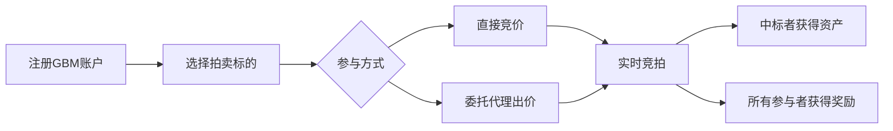

# GBM携手The Sandbox等开启拍卖节 创新Win-Win拍卖模式引关注

## Web3生态共建新型拍卖体系

2025年6月26日，伦敦——GBM协议正式宣布启动首届**Auction Festival**拍卖节。这项为期两个多月的生态活动联合了The Sandbox、Aavegotchi、Unstoppable Domains等头部Web3项目，通过创新的Win-Win拍卖模式重新定义区块链资产交易方式。本次拍卖节不仅是GBM协议的全面启动标志，更预示着数字资产交易范式的重要转变。

👉 [了解Web3生态最新动态](https://bit.ly/okx_welcome)

## 传统拍卖模式的突破性革新

在传统拍卖机制中，仅有最高出价者能获得拍品，这种"赢家通吃"的模式存在三大痛点：
1. **参与者权益缺失**：大量竞价者投入时间与资金却无任何回报
2. **价格发现失真**：竞拍者倾向于压低出价或延后出手，影响真实市场价值判断
3. **社区参与度低迷**：未能有效激励用户持续参与

GBM的Win-Win模式通过三大创新机制破解行业难题：
| 机制维度       | 传统模式           | GBM模式                  |
|----------------|--------------------|--------------------------|
| 参与回报       | 仅最高出价者获益   | 所有参与者均获得奖励     |
| 资金利用率     | 单次有效出价       | 多次有效竞价形成价格曲线 |
| 社区激励       | 短期收益驱动       | 长期生态价值共享         |

## 生态伙伴共建价值网络

本次拍卖节吸引了多个顶级Web3项目的积极参与：
- **The Sandbox**：推出限量虚拟土地拍卖，用户可通过竞价获得品牌周边虚拟地产
- **Unstoppable Domains**：发行去中心化域名，支持自定义Web3身份标识
- **Aavegotchi**：推出NFT+DeFi融合玩法，拍卖稀有数字宠物装备
- **Freename**：提供区块链域名服务，打造个性化数字身份入口

👉 [探索更多Web3创新应用](https://bit.ly/okx_welcome)

## 核心参与价值解析

### Win-Win模式运作机制
1. **多重奖励体系**：未中标者可获得基础代币+生态积分返还
2. **动态价格发现**：通过多轮竞价形成市场真实价值判断
3. **社区治理权**：累计竞价行为可转化为治理代币投票权

### 用户参与路径

## 拍卖节亮点前瞻

### 三大核心模块
1. **主题拍卖**：每周推出特色数字资产，如The Sandbox虚拟地产周、Aavegotchi宠物装备周
2. **社区任务**：完成指定任务获取额外奖励，包括：
   - 累计出价次数奖励
   - 邀请好友参与机制
   - 社区治理提案贡献值
3. **Token激励**：通过竞价行为积累GBM代币空投资格，总量600万枚代币将按比例分配

### 数据表现验证模式优势
GBM测试阶段已实现：
- 累计竞价金额突破2亿美元
- 用户日均活跃度达12.7万次
- 平均拍卖参与人数为传统模式的4.2倍
- 重复参与用户占比达63%

## 常见问题解答

### Q1：Win-Win模式如何保证经济可持续性？
A：通过动态奖励池机制实现自我调节，每次拍卖收取2%手续费注入奖励基金，同时设置代币回购销毁机制确保价值捕获。

### Q2：如何确保拍卖过程的公平性？
A：采用链上透明出价+零知识证明技术，既保证竞价数据可验证性，又保护用户隐私。所有拍卖记录均可在区块链浏览器查询。

### Q3：未中标用户获得的奖励形式是什么？
A：包含GBM协议原生代币、合作项目生态积分、NFT空投资格等多元组合，具体比例根据拍卖标的类型动态调整。

### Q4：如何参与社区治理？
A：累计有效竞价金额可兑换治理代币，每100美元竞价额度对应1个投票权，参与社区提案与协议升级决策。

👉 [立即参与Web3创新实践](https://bit.ly/okx_welcome)

## 未来发展趋势

随着拍卖节的启动，GBM协议将重点推进：
1. **跨链兼容**：计划接入Cosmos、Polkadot生态，实现多链资产互通
2. **现实资产映射**：探索实体艺术品、房地产等链下资产数字化拍卖