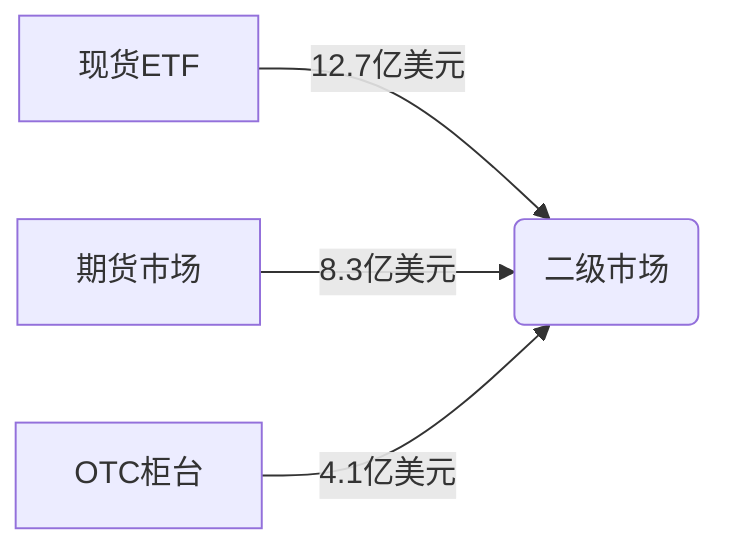

```markdown
# 比特币又遭遇一波闪崩！发生了什么?

## 市场行情回顾
3月19日，比特币价格出现剧烈波动，从历史高点73,794美元一度暴跌至62,414美元，单日跌幅超7%。此次闪崩引发22万人爆仓，24小时内全网清算金额达23.8亿美元（Coinglass数据）。值得注意的是，BitMEX平台曾出现极端行情，比特币价格短时跌至8,900美元，触发市场恐慌情绪。

👉 [加密市场波动加剧，如何把握投资机遇?](https://bit.ly/okx_welcome)

## 交易所异常交易调查
BitMEX交易所已启动专项调查，重点排查异常交易行为。据雅虎财经报道，该平台发现以下可疑现象：
- 巨额卖单集中抛售（价值约4.2亿美元）
- 算法交易策略异常激活
- 稳定币USDT兑换出现流动性缺口

> "我们正在核查是否存在订单簿操纵行为，初步排除系统漏洞风险" —— BitMEX官方声明

## 机构投资者动态
高盛数字资产主管Mathew McDermott指出："当前市场呈现双轮驱动格局"：
| 驱动力 | 特征表现 | 市场影响 |
|--------|----------|----------|
| 散户热潮 | Coinbase新增账户环比增长37% | 短期波动加剧 |
| 机构入场 | 贝莱德IBIT周流入资金超8亿美元 | 长期价值夯实 |

👉 [机构级投资工具如何布局?](https://bit.ly/okx_welcome)

## ETF资金流动分析
灰度比特币信托（GBTC）出现创纪录资金外流：
- 单日流出6.43亿美元
- 2024年累计流出达25亿美元
- 与贝莱德IBIT形成直接竞争

市场观察人士指出，ETF市场结构变化正重构资金流向，现货ETF规模已达420亿美元，较年初增长180%。

## 价格波动多维解析
### 技术面因素
- 历史高位附近存在技术性回调需求
- 杠杆率超过警戒线（72%用户使用3倍以上杠杆）
- 期权市场隐含波动率升至45%

### 基本面变化
- 美联储加息预期反复（CME FedWatch显示5月加息概率升至68%）
- 地缘政治风险溢价回落（俄乌冲突相关交易量下降41%）
- 矿机算力增速放缓（BTC.com数据显示周增速降至0.8%）

### 资金流动路径


## 投资者常见问题
**Q：本次闪崩是否意味着牛市终结？**  
A：从资金流动监测看，机构抄底盘已现。3月19日22:00-24:00，链上大额转账（≥1000BTC）激增173%，显示巨鲸开始布局。

**Q：如何设置科学的止损机制？**  
A：建议采用动态止盈止损策略：
1. 波动率通道法（ATR指标）
2. 黄金分割位追踪
3. 流动性缺口监测

**Q：ETF资金流出是否持续？**  
A：根据CoinShares周报，截至3月18日，比特币ETF实现连续11周净流入，当前资金轮动属于正常调仓行为。

👉 [专业级风控工具推荐](https://bit.ly/okx_welcome)

## 市场前景展望
CBOE比特币波动率指数（BVOL）显示，短期恐慌情绪已释放78%。链上数据显示：
- 持仓超1年地址增加12.4%
- 交易所储备降至1.8年新低
- 智能合约交互量环比增长23%

多位分析师指出，当前回调与2023年7月行情高度相似，技术形态显示可能形成双底结构。建议投资者关注4月减半事件前的布局窗口，重点关注Layer2赛道与现货ETF套利机会。
```