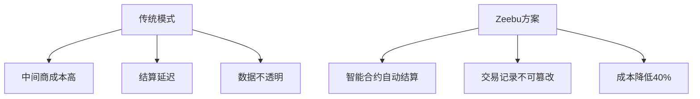

# 迪拜2024年五大颠覆性加密货币项目

## 迪拜的区块链雄心

迪拜作为阿联酋最具创新精神的城市，其对区块链技术的重视可追溯至2016年。迪拜未来基金会成立的全球区块链委员会，以及2024年在迪拜国际金融中心（DIFC）落成的AI园区，共同构成了这座城市在Web3领域的战略基石。OKX于2024年7月获得迪拜虚拟资产服务提供商牌照，正是这座城市开放包容监管环境的明证。

> **行业数据**：根据Chainalysis 2023年加密货币地理报告，阿联酋在中东和北非地区DeFi活动占比排名第二，凸显其作为加密枢纽的地位。

👉 [探索迪拜区块链发展最新动态](https://bit.ly/okx_welcome)

## 核心项目深度解析

### 1. Komainu：机构级加密资产托管先锋

作为Nomura、Ledger与CoinShares的合资公司，Komainu通过三大核心服务重塑机构数字资产管理：

| 服务模块       | 核心功能                           | 安全特性                 |
|----------------|------------------------------------|--------------------------|
| 托管解决方案   | 资产隔离存储、区块链可验证         | 多重监管认证（VARA/JFSC）|
| Komainu Connect| 去中心化抵押资产管理               | 消除第三方风险           |
| 质押服务       | PoS网络奖励获取                    | 机构定制化方案           |

该平台已与OKX等头部机构建立合作，其合规优势在2024年机构加密资金流入创纪录的背景下显得尤为重要。

### 2. Quaranium：量子安全区块链革命者

面对量子计算对传统加密算法的威胁，Quaranium构建了革命性混合架构：

- **双层技术架构**：结合PoW区块链与PoR BlockDAG
- **物联网优化**：支持每秒百万级微交易
- **民主化网络**：通过Proof of Respect共识机制

> **技术突破**：其白皮书显示，量子抗性算法可使数据安全性提升1000倍以上。

👉 [了解量子计算对区块链的影响](https://bit.ly/okx_welcome)

### 3. Wizardia：元宇宙游戏经济新范式

这款AAA级P2E游戏通过NFT和代币经济构建了完整的游戏生态：

- **资产价值化**：魔法师NFT可升级/租赁
- **收益机制**：竞技场活动年化收益达76%
- **经济模型**：WZRD代币市值3.08亿美元

其创新点在于将区块链透明性与传统游戏机制结合，开辟了Web3游戏2.0时代。

### 4. Zeebu：电信行业去中心化改造

通过区块链重构电信批发语音市场，Zeebu解决了行业三大痛点：

该平台已实现语音流量交易效率提升300%，为传统行业数字化转型提供范本。

### 5. Empeiria：AI数据可信基础设施

2021年推出的EVDI系统重新定义数据生命周期管理：

- **技术栈**：DID+零知识证明+自主身份
- **应用场景**：AI模型训练数据溯源
- **行业影响**：数据资产化市场规模年增23%

其创新的"数据所有权经济"模式，为AI与Web3融合发展提供了关键基础设施。

## 常见问题解答

**Q：迪拜加密产业的发展优势在哪里？**
A：迪拜政府通过三大支柱构建竞争优势：前沿监管框架（VARA）、产业集群效应（DIFC）、税收优惠政策（零资本利得税）。

**Q：如何评估加密项目的可信度？**
A：建议采用"3T评估法"：技术原创性（Technology）、团队资质（Team）、合规认证（Trust），并重点关注审计报告和社区活跃度。

**Q：量子计算对现有加密项目有何影响？**
A：量子威胁主要集中在非对称加密算法，但Quaranium等项目已推出抗量子算法。普通用户可通过资产分散存储降低风险。

## 未来展望

迪拜加密产业呈现三大趋势：
1. **监管科技化**：2024年DFSA升级加密资产框架
2. **技术融合**：AI+区块链应用年增67%
3. **行业渗透**：传统企业Web3改造率已达38%

> **市场预测**：Statista数据显示，阿联酋加密货币年复合增长率将达7.89%，2028年市场规模有望突破420亿美元。

👉 [获取最新加密市场数据](https://bit.ly/okx_welcome)

## 投资者警示

加密资产具有高波动性，投资前需：
1. 完成项目技术审计
2. 评估团队过往业绩
3. 关注监管合规状态
4. 配置不超过资产10%的仓位

OKX中东金融科技公司持有VARA第VL/23/12/003号虚拟资产服务牌照，为用户提供合规保障。