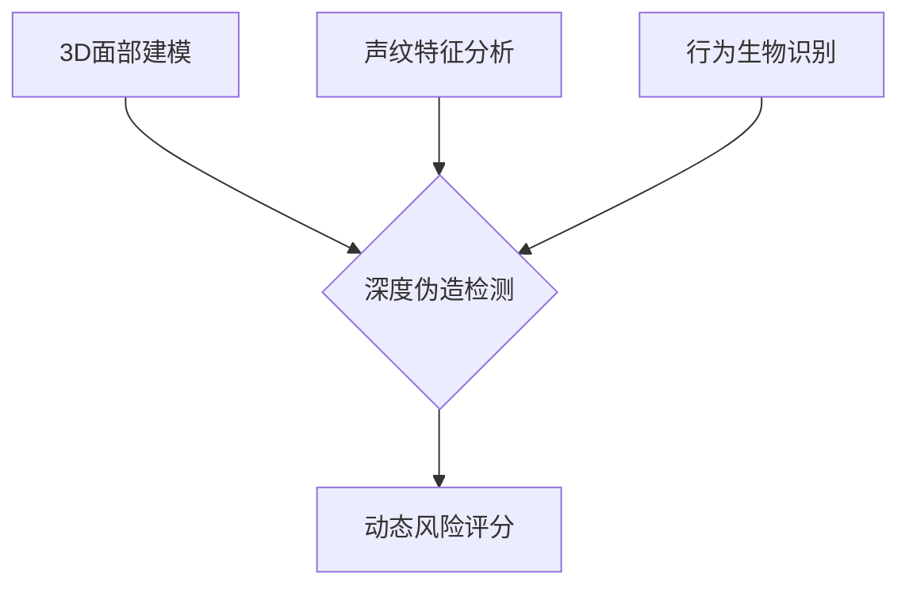

# OKX Protect：安全加密交易与自托管解决方案

## 核心优势解析
👉 [探索OKX安全解决方案](https://bit.ly/okx_welcome)

### 多维度安全架构
OKX Protect构建了覆盖交易全流程的防护体系，通过三大核心模块实现资产全方位保护：
- **智能风控引擎**：实时监测异常交易行为
- **多重身份验证**：生物特征与硬件双重认证
- **动态安全策略**：基于AI的自适应防护机制

### 关键技术亮点
| 技术模块       | 核心功能                  | 安全效益提升               |
|----------------|---------------------------|---------------------------|
| Eagle-Eye      | 深度伪造检测               | 身份验证准确率提升至99.98% |
| TARDIS         | 行为轨迹分析               | 风险交易拦截效率提升400%  |
| SkyNet         | 链上欺诈识别               | 恶意地址识别速度缩短至3秒  |

## 安全防护体系详解

### 独立验证保障
我们通过全球顶尖安全机构的多重认证，包括：
- **CertiK审计**：连续三年获得AAA级安全评级
- **慢雾科技渗透测试**：发现并修复200+潜在漏洞
- **区块链安全联盟（BSC）** 成员单位

### 资产托管方案
👉 [了解自托管技术原理](https://bit.ly/okx_welcome)

用户可自主选择两种托管模式：
1. **热钱包模式**：适用于高频交易者，支持秒级到账
2. **冷钱包集群**：企业级资金管理，支持多重签名机制

#### 储备证明机制
我们采用创新的Merkle Tree验证技术，实现：
- 实时资产审计：每小时更新链上数据
- 透明度可视化：用户可自主验证资产储备
- 1:1准备金保障：持有资产总量始终≥用户负债总额

## 智能防护系统运作

### AI安全矩阵
**Eagle-Eye系统**通过以下技术实现身份识别：

**TARDIS引擎**采用机器学习模型分析：
- 用户操作序列模式
- 交易时间分布特征
- 地理位置变化轨迹
- 设备指纹关联性

**SkyNet系统**实时监控超过：
- 500万活跃地址
- 10万+交易节点
- 200+区块链协议

## 常见问题解答

### 什么是自托管解决方案？
自托管模式允许用户完全掌控私钥，OKX提供：
- 硬件安全模块(HSM)保护
- 分布式密钥分片技术
- 社会恢复机制

### 如何验证储备证明？
用户可通过以下步骤自主验证：
1. 登录账户获取专属验证密钥
2. 通过区块链浏览器查询对应区块
3. 使用SHA-256算法校验数据哈希
4. 对比系统显示的实时储备率

### AI安全系统如何工作？
我们的智能防护包含：
- 实时威胁情报网络
- 异常行为检测模型
- 自动化应急响应机制
- 人工复核团队7×24小时待命

## 技术创新优势
👉 [获取最新安全白皮书](https://bit.ly/okx_welcome)

### 深度伪造防御
采用多模态生物识别技术：
- 微表情动态分析
- 红外活体检测
- 语音-面部同步验证

### 链上追踪系统
支持跨链资产监控，覆盖：
- BTC/ETH等主流链
- Solana/Polkadot等高性能链
- Layer2扩容方案

## 安全实践建议

### 账户保护策略
- 启用硬件安全密钥
- 设置IP白名单访问
- 定期更新安全问题
- 开启双重身份验证

### 交易安全守则
1. 大额转账前进行人工确认
2. 定期检查设备安全状态
3. 避免在公共WiFi下操作
4. 设置动态风险阈值提醒

通过上述多重防护机制，OKX Protect为用户提供行业领先的加密资产安全解决方案，持续保障数字资产安全。