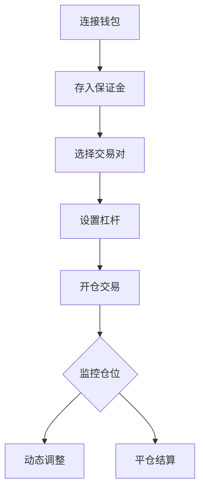

# dYdX 2025 年全面解析：掌握去中心化交易核心要点

## 什么是 dYdX？

dYdX 是当前去中心化金融（DeFi）领域最具创新性的交易平台之一，专注于为用户提供高杠杆永续合约交易服务。与传统交易所不同，这个建立在以太坊区块链上的去中心化交易所（DEX）通过 **Layer-2 扩展技术**，在保持安全性的同时显著降低了交易成本。

作为融合中心化交易所功能与去中心化优势的创新型平台，dYdX 允许用户以高达 **25 倍杠杆** 进行交易，同时保持对资产的完全控制权。其原生代币 **DYDX** 在平台治理和激励机制中扮演核心角色。

---

## 平台核心优势

### 1. 创新技术架构

| 技术特性 | 优势说明 |
|---------|----------|
| Layer-2 扩展方案 | 通过 StarkWare 技术实现零 gas 费用交易 |
| 非托管模式 | 用户始终掌握私钥和资产控制权 |
| 永续合约系统 | 支持主流加密货币的无到期日合约交易 |

👉 [探索 dYdX 与 OKX 交易功能的异同](https://bit.ly/okx_welcome)

### 2. 交易产品矩阵

- **永续合约**：涵盖 ETH/USDC、BTC/USDC 等主流交易对
- **保证金交易**：支持多币种抵押品管理
- **流动性挖矿**：通过提供流动性获取 DYDX 奖励
- **NFT 赋能**：Hedgies 系列 NFT 提供交易费折扣

---

## 核心功能解析

### 永续合约交易

作为平台的明星产品，永续合约提供：
- 最高 25 倍杠杆
- 零资金费率机制
- 深度流动性池支持
- 实时标记价格系统

### Layer-2 技术优势

| 指标 | 传统 L1 交易 | dYdX L2 解决方案 |
|------|-------------|------------------|
| 单笔交易费 | $10+ | <$0.01 |
| 确认速度 | 15+ 秒 | <1 秒 |
| TPS | <30 | 10,000+ |

👉 [对比主流 Layer-2 交易平台](https://bit.ly/okx_welcome)

---

## 使用指南

### 账户设置

1. 连接兼容钱包（MetaMask/Trezor/Ledger）
2. 完成链上身份验证
3. 存入 USDC 或 ETH 作为保证金

### 交易流程



### 提款注意事项

- 最小提款额：$10 USDC 或等值资产
- 处理时间：5-15 分钟（取决于网络状态）
- 手续费：约 $0.5-$2（Layer-1 网络费）

---

## 风险管理策略

### 初学者建议

1. 从 1-5 倍杠杆开始练习
2. 设置 15%-20% 止损区间
3. 单笔风险控制在总资金的 2% 以内

### 专业交易技巧

- 跨市场套利：利用现货与合约价差
- 波动率交易：通过 Vega 敏感度获利
- 期限结构交易：捕捉资金费率变化

---

## 常见问题解答（FAQ）

**Q：dYdX 支持哪些钱包？**  
A：兼容所有 EVM 钱包，包括 MetaMask、Trust Wallet、Ledger 等硬件钱包，建议高净值用户使用硬件钱包确保安全。

**Q：美国用户能否使用？**  
A：根据平台最新政策，美国用户可通过 KYC 验证参与部分现货交易，但永续合约功能仍受限。

**Q：DYDX 代币有哪些用途？**  
A：主要功能包括：
- 治理投票权（协议升级/参数调整）
- 交易费折扣（最高 50%）
- 流动性挖矿奖励
- 参与 NFT 空投

**Q：如何降低滑点？**  
A：建议：
- 使用限价单而非市价单
- 选择流动性高的交易对
- 避开重大新闻事件
- 分拆大额订单

**Q：清算机制如何运作？**  
A：采用阶梯式保证金制度，维持保证金率通常为 5%-10%。当账户净值低于此阈值时，系统将自动平仓。

---

## 平台对比分析

| 功能维度 | dYdX | 行业平均 |
|---------|------|----------|
| 最大杠杆 | 25x | 100x |
| 交易对数量 | 15+ | 50+ |
| 日均交易量 | $15 亿 | $50 亿 |
| 安全评级 | ★★★★☆ | ★★★★ |
| 新手友好度 | ★★★☆☆ | ★★★★☆ |

👉 [查看最新加密交易平台排名](https://bit.ly/okx_welcome)

---

## 风险提示

1. **极端波动风险**：加密货币市场单日波动超 20% 属常见现象
2. **协议风险**：尽管通过多项审计，但智能合约漏洞仍可能造成损失
3. **监管风险**：全球监管政策变化可能影响服务范围
4. **操作风险**：私钥管理不当可能导致资产被盗

建议用户：
- 定期更新钱包软件
- 启用多重验证
- 分散存储资产
- 关注官方公告

---

## 未来发展展望

2025 年 dYdX 的核心发展方向包括：
- 推出现货交易移动端应用
- 扩展至 ZK-Rollups 技术栈
- 增加传统金融资产映射
- 优化 MEV 保护机制
- 开发机构级 API 接口

平台正在构建的 **V4 版本** 将引入：
- 改进的订单簿架构
- 跨链保证金系统
- 基于声誉的清算折扣
- 动态资金费率模型

---

## 生态系统扩展

dYdX 正在构建完整的 DeFi 生态：
1. **借贷协议**：支持抵押品跨平台使用
2. **保险基金**：由 DYDX 代币质押者共同维护
3. **开发者平台**：提供交易数据 API 和 SDK
4. **教育中心**：包含视频教程、策略指南和模拟交易系统

其 Hedgies NFT 项目已实现：
- 交易费折扣（5%-30%）
- 空投优先权
- 社区治理提案权
- 专属 Discord 权限

---

## 技术深度解析

### 订单匹配引擎

采用 **Conditional Token Transfers** 技术，实现：
- 无需许可的流动性提供
- 链下撮合 + 链上结算
- 抗审查交易机制

### 风险控制系统

多层风控架构包括：
1. 强制平仓引擎
2. 保险基金池
3. 动态保证金调整
4. 预言机价格熔断机制

---

## 使用技巧与优化

### 提高交易效率
1. 利用 TradingView 集成进行技术分析
2. 设置价格警报（可通过 Discord 机器人实现）
3. 使用批量下单功能
4. 优化 Gas 费用策略（通过 StarkNet 批处理）

### 资金管理建议
```python
# 动态仓位计算器示例
def calculate_position_size(account_value, risk_percent, stop_loss):
    risk_amount = account_value * risk_percent / 100
    position_size = risk_amount / stop_loss * current_price
    return min(position_size, account_value * 0.2)  # 单笔不超过20%
```

---

## 未来趋势洞察

2025 年加密交易市场三大趋势：
1. **机构参与度提升**：预计机构交易量占比将突破 40%
2. **合规化发展**：全球 30+ 国家将出台明确监管框架
3. **技术融合**：AI 交易系统与 DeFi 的深度结合

dYdX 在此背景下，正通过：
- 开发机构托管解决方案
- 建立合规交易对筛选机制
- 集成机器学习预测模型

来巩固其在去中心化衍生品交易领域的领先地位。