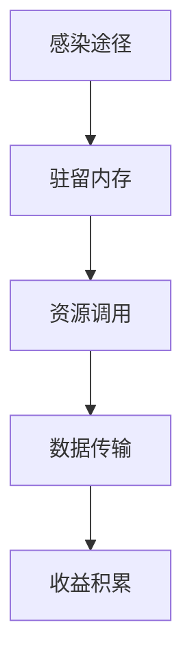

# 什么是加密劫持及其防范指南

加密劫持是一种利用他人设备资源进行非法加密货币挖矿的网络攻击形式，其核心在于通过隐蔽手段占用计算资源牟取利益。本文将系统解析其运作机制、危害特征及防御策略，并提供实用防护建议。

## 加密劫持运作机制全解析

### 感染阶段的技术特征
攻击者主要通过以下途径植入恶意程序：
- **漏洞利用**：针对未更新的浏览器插件、操作系统漏洞进行精准攻击
- **社会工程学**：伪装成软件更新包、文档附件或虚假安装程序
- **网页脚本注入**：通过被篡改的第三方广告网络或插件传播

> 案例警示：2023年某视频网站因广告SDK漏洞导致300万用户设备被植入挖矿脚本

### 挖矿过程的技术细节
恶意程序通常执行以下操作：
1. 调用CPU/GPU核心进行哈希计算
2. 连接矿池服务器同步工作量证明
3. 将计算结果提交至攻击者钱包地址

### 反检测技术演进
现代加密劫持程序采用：
- **动态加载技术**：将核心代码拆分为多个加密模块
- **行为模拟检测**：识别虚拟机/沙箱环境避免触发警报
- **资源占用控制**：动态调整算力占用率维持设备可用性

## 防御体系构建指南

### 五层防护模型
| 防护层级 | 关键技术 | 实施要点 |
|---------|----------|----------|
| 终端层 | 行为监控软件 | 实时检测异常进程树 |
| 网络层 | 流量分析系统 | 识别矿池通信特征 |
| 应用层 | 浏览器扩展 | 阻止Web挖矿脚本 |
| 数据层 | 完整性校验 | 检测系统文件修改 |
| 管理层 | 安全策略 | 设备资源使用审计 |

👉 [获取专业级防护解决方案](https://bit.ly/okx_welcome)

### 检测指标阈值参考
- **CPU占用率**：持续>70%且无对应程序
- **内存占用**：单进程>2GB且无明确用途
- **网络流量**：每小时>50MB矿池通信
- **温度异常**：设备温度>85°C且非高负载场景

## 典型攻击案例深度剖析

### Coinhive攻击链分析
该攻击模式具有里程碑意义：
1. **传播方式**：通过被篡改的JavaScript库感染
2. **技术特点**：采用WebAssembly提升运算效率
3. **影响范围**：曾感染全球TOP100网站中的17个

> 数据统计：单个受感染页面可产生日均$0.03收益，累计造成超$2500万损失

### Smominru僵尸网络追踪
该僵尸网络具备以下特征：
- **感染规模**：峰值控制52万台设备
- **攻击手段**：结合EternalBlue漏洞与暴力破解
- **收益模式**：日均生成价值$2400的XMR币

👉 [查看实时攻击地图](https://bit.ly/okx_welcome)

## 危害影响量化分析

### 直接经济损失模型
| 损失类型 | 计算公式 | 年均损失估算 |
|---------|----------|--------------|
| 电力消耗 | 算力(W)×运行时长(h)×电价 | $0.45/设备 |
| 硬件损耗 | 维修率×设备单价 | $28/设备 |
| 生产力损失 | 时间损耗×人力成本 | $153/员工 |

### 间接安全风险
- **数据泄露**：攻击者可能同时部署信息窃取模块
- **合规风险**：违反GDPR等数据保护法规
- **声誉损害**：企业安全事件导致客户信任下降

## 常见问题解答

### 如何判断设备是否被劫持？
关注三大异常信号：
1. 设备风扇持续高转速运行
2. 任务管理器显示未知进程占用高算力
3. 流量监控显示异常外联通信

### 个人用户防护建议
- 安装带挖矿防护功能的杀毒软件
- 在浏览器启用NoCoin等扩展
- 定期检查启动项和服务列表

### 企业级防护方案
- 部署EDR系统实时监控进程行为
- 实施网络流量DPI检测
- 建立设备资源使用基线模型

👉 [获取企业安全评估方案](https://bit.ly/okx_welcome)

## 防护技术发展趋势

### 检测技术演进方向
- **AI行为分析**：通过机器学习识别异常资源使用模式
- **区块链溯源**：追踪非法挖矿收益流向
- **硬件级防护**：利用TPM芯片进行算力访问控制

### 未来挑战与对策
- **物联网设备防护**：针对智能设备的轻量化检测方案
- **云环境防护**：容器化环境下的资源隔离策略
- **法律规制完善**：推动全球统一的电子证据标准

建议用户定期进行安全审计，保持系统更新，并关注官方发布的威胁预警信息。通过构建多层次防护体系，可将加密劫持风险降低90%以上。