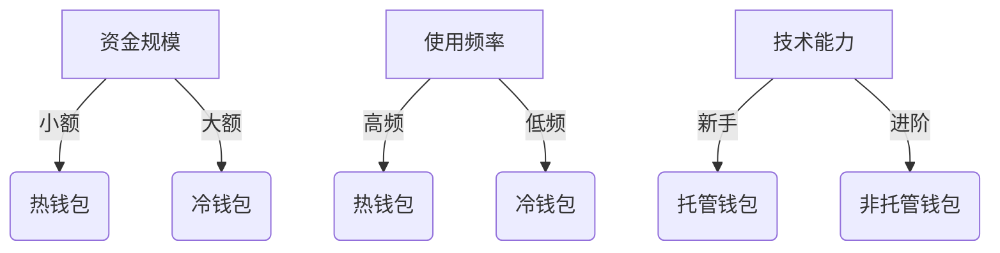

# 以太坊钱包操作指南：如何高效安全地处理货币

## 一、以太坊钱包的核心价值与应用场景
以太坊钱包作为区块链技术的重要入口，不仅是数字资产存储工具，更是连接Web3世界的通行证。通过智能合约技术，用户可实现价值转移、参与去中心化金融（DeFi）、NFT交易等多元化操作。掌握钱包使用技巧，是每位加密货币用户必修的基础课程。

👉 [探索更多DeFi投资机会](https://bit.ly/okx_welcome)

## 二、钱包类型深度解析
### 1. 热钱包 vs 冷钱包特性对比
| 类型   | 优势                      | 风险点                  | 适用场景               |
|--------|---------------------------|-------------------------|------------------------|
| 热钱包 | 实时交易、操作便捷        | 面临网络攻击风险        | 日常小额交易           |
| 冷钱包 | 物理隔离、安全性高        | 操作门槛相对较高        | 大额资产长期存储       |

**主流钱包推荐：**
- MetaMask：浏览器插件式热钱包，DeFi交互首选
- Ledger：硬件冷钱包代表，支持多链资产
- Trust Wallet：移动端友好，Binance官方推荐

### 2. 钱包选择决策树


## 三、创建钱包的标准化流程
### 1. MetaMask创建指南（2024新版界面）
1. 访问官网下载浏览器扩展
2. 创建账户时设置12位强密码（建议含大小写字母+数字）
3. 备份助记词（推荐使用[密码管理器]或离线存储）
4. 验证钱包地址格式：0x开头+40位十六进制数

**安全提醒：**
- 助记词与私钥切勿截图存储
- 建议开启二次验证（Google Authenticator）
- 定期检查钱包版本更新

### 2. 钱包恢复全流程
当更换设备时，通过助记词导入步骤：
1. 打开钱包应用选择"导入钱包"
2. 输入12/24位助记词
3. 设置新密码
4. 验证资产同步状态

👉 [了解行业领先的加密货币钱包](https://bit.ly/okx_welcome)

## 四、交易操作全攻略
### 1. 收发币标准操作
**接收流程：**
1. 打开钱包选择"接收"
2. 复制钱包地址（校验前缀0x）
3. 通过邮件/IM工具发送地址

**发送流程：**
1. 点击"发送"按钮
2. 粘贴目标地址（务必二次核对）
3. 输入金额（建议首次小额测试）
4. 设置Gas费用（关键操作）

### 2. Gas费用优化策略
| 网络状态 | Base Fee(Gwei) | 小费(Gwei) | 总费用估算 |
|----------|----------------|------------|------------|
| 低峰期   | 10             | 1-2        | $0.5       |
| 高峰期   | 100+           | 10+        | $5+        |

**调优技巧：**
- 使用Etherscan Gas Tracker实时监控
- 选择网络低峰期操作（UTC时间凌晨）
- 开启MetaMask的Gas价格预警

## 五、资产安全防护体系
### 1. 五层防护模型
1. **物理层**：冷钱包离线存储
2. **访问层**：强密码+二次验证
3. **网络层**：专用设备+安全网络
4. **应用层**：定期更新钱包版本
5. **数据层**：多重备份（云端+纸质+硬件）

### 2. 高危行为预警
- 接收陌生Token可能引发钓鱼
- 钱包地址重复使用增加暴露风险
- 智能合约交互前需验证代码审计

👉 [获取专业级资产安全方案](https://bit.ly/okx_welcome)

## 六、高频问题解决方案
### Q1: 助记词遗忘如何补救？
A: 需要满足两个条件：
1. 曾使用密码管理器存储备份
2. 拥有设备本地存储的keystore文件
若全部遗失，建议立即冻结账户并联系钱包服务商

### Q2: 交易卡顿如何处理？
A: 执行以下步骤：
1. 在区块浏览器查询交易状态
2. 使用"加速"功能提升Gas费用
3. 若未确认，可发送"0 ETH"覆盖交易

### Q3: 如何参与DeFi质押？
A: 四步操作指南：
1. 连接MetaMask至DeFi平台
2. 授权Token使用额度
3. 选择质押池（注意APY波动）
4. 确认智能合约交互费用

### Q4: 国内用户合规操作？
A: 遵守现行监管要求：
- 禁止法定货币兑换
- 仅限链上资产转移
- 不得参与NFT二级市场
建议关注央行数字货币进展

## 七、进阶操作指南
### 1. 多签钱包配置
适用于机构用户或大额资产，需设置：
- 2-of-3签名机制
- 不同设备存储私钥
- 定期更新签名地址

### 2. 隐私增强方案
- 使用Tornado Cash混币服务
- 创建新地址进行敏感交易
- 开启钱包隐身模式

### 3. Gas费用预测模型
基于历史数据构建：
```
预测Gas = (前24小时均价 × 0.7) + (即时需求指数 × 1.3)
```
建议设置自动调节阈值（±20%）

## 八、行业趋势与合规提示
2024年以太坊升级后，钱包功能呈现三大趋势：
1. EIP-4337账户抽象化提升安全
2. 生物识别技术集成
3. 多链聚合管理能力增强
