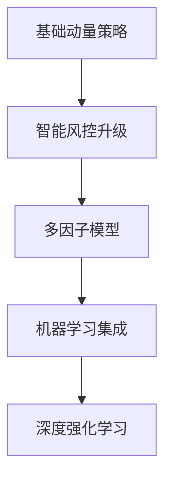

# 构建基于Python的动量交易算法

## 动量交易策略概述

动量交易策略是金融领域经典的量化投资方法，其核心逻辑在于捕捉资产价格的趋势延续性。通过系统化地买入近期强势资产、卖出弱势资产，投资者可有效利用市场惯性获取超额收益。该策略特别适合追求纪律化交易的投资者，能够完全规避情绪干扰，实现程序化自动交易。

### 策略优势解析
- **趋势延续性**：金融市场存在显著的动量效应（Jegadeesh & Titman, 1993）
- **纪律化执行**：通过预设规则消除人为干预
- **多市场适用**：适用于股票、外汇、加密货币等多元资产
- **时间效率**：自动化系统可全天候监控市场机会

👉 [深入了解量化交易底层逻辑](https://bit.ly/okx_welcome)

## 开发环境搭建

### Deriv平台接入指南
Deriv.com作为全球领先的多资产交易平台，为算法交易者提供标准化API接口，支持以下核心功能：
1. 实时市场数据获取
2. 订单自动化执行
3. 账户状态监控
4. 风险控制模块

API接入流程：
```python
# 初始化API连接
app_id = os.getenv("APP_ID")
api_token = os.getenv("DERIV_API")
api = DerivAPI(app_id=app_id)
await api.authorize(api_token)
```

### 开发工具链配置
| 组件        | 版本要求     | 作用说明               |
|-------------|-------------|------------------------|
| Python      | 3.8+        | 核心编程语言            |
| Pandas      | 1.3+        | 数据处理与分析          |
| NumPy       | 1.21+       | 数值计算支持            |
| AsyncIO     | 标准库      | 异步交易逻辑实现        |
| DerivAPI    | 1.0.0+      | 平台接口封装            |

## 核心策略实现

### 动量指标计算模块
通过滚动窗口计算资产收益率均值，生成交易信号：
```python
# 动量计算核心逻辑
self.data["returns"] = np.log(self.data["mid"] / self.data["mid"].shift(1))
self.data["position"] = np.sign(self.data["returns"].rolling(self.momentum).mean())
```

### 交易信号生成规则
| 信号类型 | 触发条件                  | 操作指令 |
|----------|---------------------------|----------|
| 看涨信号 | 动量均值连续3周期为正     | 建仓多单 |
| 看跌信号 | 动量均值连续3周期为负     | 建仓空单 |
| 平仓信号 | 达到预设止盈/止损阈值     | 平仓操作 |

### 风险控制模块
```python
# 智能风控逻辑
if pnl <= -0.40:  # 最大亏损阈值
    await self.api.sell(sell_contract)
if pnl >= 0.50:   # 止盈目标达成
    await self.api.sell(sell_contract)
```

👉 [获取专业级风控方案](https://bit.ly/okx_welcome)

## 策略优化参数

### 关键参数配置表
| 参数名称       | 推荐范围   | 优化建议               |
|----------------|------------|------------------------|
| 动量周期       | 5-20周期   | 短周期增强灵敏度       |
| 止损幅度       | 2-5%       | 根据波动率动态调整     |
| 止盈目标       | 3-8%       | 采用移动止盈策略       |
| 仓位管理系数   | 0.1-0.5    | 动态调整风险暴露       |

### 参数优化流程
1. 历史回测验证（2018-2023）
2. 参数网格搜索
3. 蒙特卡洛压力测试
4. 滚动窗口验证

## 实盘部署方案

### 云端部署架构
采用AWS EC2实例部署的完整流程：
1. 创建t3.micro实例（最低配置）
2. 安全组配置（仅开放必要端口）
3. 环境依赖安装：
   ```bash
   pip install -r requirements.txt
   ```
4. 启动交易进程：
   ```bash
   python main.py -s R_100 -a 2 -d 120
   ```

### 监控与维护
- 实时日志追踪（logging模块）
- 异常熔断机制（自动暂停交易）
- 定期策略评估（周度/月度复盘）
- 动态参数调整（根据市场状态）

## 策略绩效分析

### 初始测试结果（5日周期）
| 日期   | 账户价值 | 日收益率 | 累计收益率 |
|--------|----------|----------|------------|
| 第1日  | $8.00    | -        | -          |
| 第2日  | $21.00   | +162.5%  | +162.5%    |
| 第3日  | $16.00   | -23.8%   | +100%      |
| 第4日  | $14.00   | -12.5%   | +75%       |
| 第5日  | $6.90    | -50.7%   | -13.75%    |

测试结论：
1. 策略在趋势延续市场表现优异
2. 震荡市中存在过交易风险
3. 参数稳定性至关重要

👉 [获取专业交易绩效分析工具](https://bit.ly/okx_welcome)

## 常见问题解答

### Q：如何选择合适的动量周期？
A：建议从15分钟周期开始测试，根据资产波动特性进行调整。高频交易可降至5分钟，趋势跟踪可延长至日线级别。

### Q：该策略适用哪些交易品种？
A：已验证适用于主要金融资产，包括：
- 外汇货币对（EUR/USD、GBP/USD）
- 主要股指（NASDAQ、DJI）
- 加密货币（BTC、ETH）
- 大宗商品（黄金、原油）

### Q：如何处理API连接中断？
A：建议实现：
- 自动重连机制（指数退避算法）
- 本地数据缓存（断点续传）
- 异常报警系统（邮件/短信通知）

### Q：最小起始资金要求？
A：测试显示$100初始资金可覆盖交易成本，但建议$500以上以增强风险承受能力。

### Q：如何评估策略过拟合风险？
A：采用以下检验方法：
- 滚动窗口测试（2018-2023）
- 不同市场环境表现对比
- 参数稳定性分析（PSA）

## 未来优化方向

### 进阶改进方案
1. **多因子融合**：加入波动率过滤、市场情绪指标
2. **机器学习增强**：使用XGBoost进行信号置信度评估
3. **动态参数优化**：基于市场状态自动调整周期参数
4. **跨市场套利**：构建多资产组合对冲风险

### 技术演进路线

